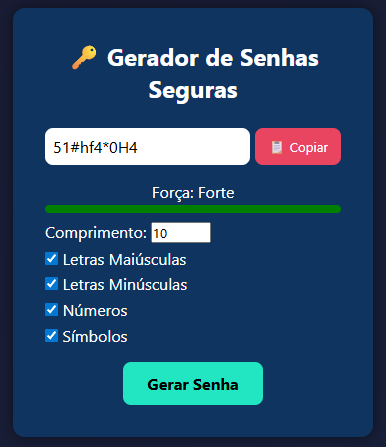
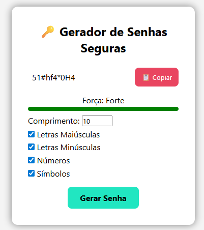

# 🔑 Gerador de Senhas Seguras

Projeto simples em **HTML, CSS e JavaScript** que gera senhas fortes e aleatórias.  
O usuário pode escolher o tamanho da senha e os tipos de caracteres que deseja incluir (maiúsculas, minúsculas, números e símbolos).  

---

## 🚀 Funcionalidades
- Definir comprimento da senha (4 até 30 caracteres).
- Escolher os tipos de caracteres:
  - ✅ Letras maiúsculas
  - ✅ Letras minúsculas
  - ✅ Números
  - ✅ Símbolos
- Botão para **copiar a senha** para a área de transferência.
- Layout responsivo e moderno (dark mode style).

---

## 🛠️ Tecnologias utilizadas
- **HTML5**
- **CSS3** (Flexbox, Gradiente, Transições)
- **JavaScript (ES6+)**